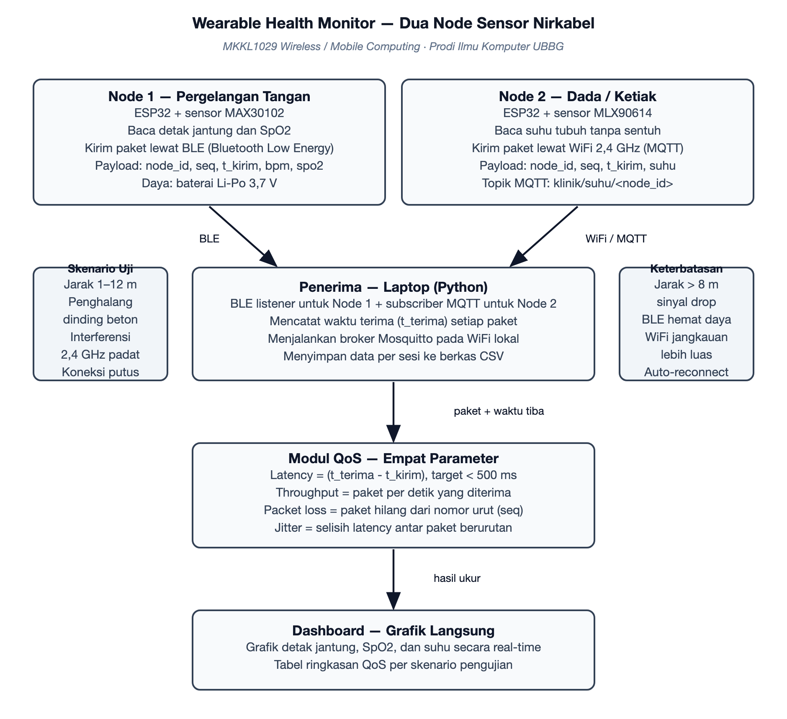

# Rencana Proyek — Wearable Health Monitor — Dua Node Sensor Nirkabel untuk Pemantauan Detak Jantung, SpO2, dan Suhu Tubuh

**Mata kuliah:** Wireless / Mobile Computing (MKKL1029) · Semester 7  
**Program Studi Ilmu Komputer — Fakultas Sains, Teknologi dan Ilmu Kesehatan, Universitas Bina Bangsa Getsempena**  
**Dosen Pengampu:** Ahmad Mujahid Abdurrahman, S.Kom, M.T.  
**Versi:** 1.0 — 19 September 2026

> Salinan kerja dari dokumen rencana proyek pada Google Docs. Perubahan wajib dilakukan pada kedua tempat agar penilaian tetap sinkron.

## 1. Identitas Kelompok

| No | Nama | NIM | Peran dalam Proyek |
|---|---|---|---|
| 1 | Yogi Prasetya Sadewa | 23210060 | Ketua kelompok; perangkat lunak penerima, perhitungan QoS, dan integrasi BLE/MQTT |
| 2 | Asmarudin | 23210133 | Perakitan node 1 (ESP32 + MAX30102) dan kalibrasi pembacaan detak jantung |
| 3 | Deski Taiza | 23210003 | Perakitan node 2 (ESP32 + MLX90614) dan pengujian pembacaan suhu tubuh |
| 4 | Akhsanul Taqwim | 23210006 | Dashboard pemantauan dan visualisasi grafik secara langsung |
| 5 | Wira | 23210045 | Pelaksanaan pengujian lapangan: variasi jarak, penghalang, dan interferensi |
| 6 | Abadi | 23210004 | Pengujian daya tahan baterai dan pencatatan waktu pemakaian |
| 7 | Ferdyan Ardhani | 23210039 | Pengolahan data hasil pengukuran menjadi tabel dan grafik laporan |
| 8 | Muhammad Iqbal | 23210142 | Perbandingan hasil pengukuran dengan alat pembanding (oximeter dan termometer) |
| 9 | Meriandi Wahyu Kurniawan | [NIM] | Dokumentasi, README, dan pengelolaan repository |

## 2. Masalah dan Tujuan

### Masalah yang diselesaikan

Pemantauan tanda vital pasien masih dilakukan secara manual: petugas datang ke tempat tidur, menempelkan alat, mencatat angka di kertas, lalu memindahkannya ke rekam medis. Cara ini memakan waktu, menyulitkan pemantauan berkelanjutan, dan tidak menghasilkan data historis yang rapi. Padahal pemantauan yang terputus membuat perubahan kondisi pasien mudah terlewat. Proyek ini membangun dua node sensor nirkabel yang dapat dikenakan pada tubuh untuk membaca detak jantung, saturasi oksigen (SpO2), dan suhu tubuh, lalu mengirimkannya secara nirkabel ke penerima untuk dipantau langsung — sekaligus mengukur seberapa andal kanal nirkabel yang dipakai.

### Latar belakang

- Alat pemantauan vital yang tersedia di pasaran umumnya mahal dan tertutup, sehingga tidak dapat dimodifikasi untuk keperluan pembelajaran.
- Mikrokontroler ESP32 dan sensor MAX30102 serta MLX90614 sudah tersedia luas dengan harga terjangkau dan pustaka yang matang.
- Belum ada pengukuran yang menunjukkan pada jarak dan kondisi ruangan seperti apa kualitas pengiriman data vital mulai menurun.

### Pengguna sasaran

- Perawat dan petugas jaga, yang membutuhkan pantauan tanda vital tanpa harus terus berada di sisi pasien.
- Dosen dan mahasiswa, sebagai sarana pembelajaran sistem sensor nirkabel dan pengukuran kualitas layanan.

### Batasan lingkup

- Dua node nirkabel: satu di pergelangan tangan (detak jantung dan SpO2) dan satu di dada atau ketiak (suhu tubuh).
- Pengujian dibatasi pada empat skenario: jarak node ke penerima, keberadaan penghalang, interferensi 2,4 GHz, dan kondisi koneksi terputus.
- Alat ini bukan perangkat medis; hasil pengukuran tidak dipakai untuk diagnosis dan hanya dibandingkan dengan alat pembanding untuk melihat selisih.
- Pengujian dilakukan pada anggota kelompok sendiri sebagai relawan, bukan pada pasien.

### Tujuan proyek

1. Membangun dua node sensor nirkabel yang benar-benar mengirim data detak jantung, SpO2, dan suhu tubuh melalui kanal nirkabel.
2. Mengukur dan melaporkan empat parameter kualitas layanan: latency, throughput, packet loss, dan jitter.
3. Mendokumentasikan keterbatasan nirkabel yang dialami — jarak, penghalang, interferensi, dan daya — beserta pengaruhnya terhadap keandalan pengiriman data vital.

## 3. Arsitektur Sistem

*Gambar 1. Arsitektur dua node sensor nirkabel dan alur data menuju penerima serta dashboard.*

### Komponen utama

- Node 1 (pergelangan): ESP32 dengan sensor MAX30102 untuk detak jantung dan SpO2, mengirim melalui BLE (Bluetooth Low Energy).
- Node 2 (dada/ketiak): ESP32 dengan sensor MLX90614 untuk suhu tubuh tanpa sentuh, mengirim melalui WiFi 2,4 GHz ke broker MQTT.
- Penerima: laptop yang menjalankan pendengar BLE untuk Node 1 dan pelanggan MQTT untuk Node 2, sekaligus menjadi tempat penyimpanan data.
- Broker MQTT (Mosquitto): perantara pesan antara Node 2 dan penerima pada jaringan WiFi lokal.
- Modul QoS: bagian perangkat lunak yang menghitung latency, throughput, packet loss, dan jitter dari setiap paket yang diterima.
- Dashboard: antarmuka grafik yang menampilkan nilai detak jantung, SpO2, dan suhu secara langsung beserta ringkasan hasil pengukuran.

### Alur data dan protokol

- Setiap node membentuk payload berisi identitas node, nomor urut paket (seq), waktu kirim (t_kirim), dan nilai sensor.
- Node 1 mengirim payload melalui BLE; Node 2 mengirim melalui WiFi ke broker MQTT dengan topik per node.
- Penerima mencatat waktu tiba (t_terima) setiap paket, lalu menghitung latency sebagai selisih t_terima dan t_kirim.
- Packet loss dihitung dari nomor urut yang tidak berurutan, jitter dari selisih latency antar paket berurutan, dan throughput dari jumlah paket yang diterima per satuan waktu.
- Hasil pengukuran disimpan sebagai berkas CSV per sesi dan ditampilkan pada dashboard sebagai grafik.

## 4. Tools dan Lingkungan

- Perangkat keras: 2 unit ESP32, sensor MAX30102, sensor MLX90614, baterai Li-Po 3,7 V, modul pengisi daya, dan kabel penghubung.
- Perangkat lunak node: Arduino IDE dengan pustaka SparkFun MAX3010x, Adafruit MLX90614, dan PubSubClient untuk MQTT.
- Perangkat lunak penerima: Python 3 dengan bleak (BLE), paho-mqtt, pandas, dan matplotlib.
- Broker: Mosquitto, dijalankan pada laptop yang sama dengan penerima.
- Pembanding: oximeter jari dan termometer digital, untuk melihat selisih pembacaan.
- Kolaborasi: GitHub untuk kode dan dokumentasi, Google Docs untuk rencana proyek, serta Issues untuk pembagian tugas.

## 5. Rencana Pencapaian UTS (Pertemuan 8)

*Target ini menjadi acuan penilaian: capaian kelompok pada Pertemuan 8 dibandingkan dengan janji berikut.*

| Bagian yang dijanjikan selesai | Bentuk bukti pada Pertemuan 8 | Penanggung jawab |
|---|---|---|
| Kedua node menyala dan mengirim payload berisi waktu kirim serta nomor urut | Catatan keluaran serial kedua node dan paket yang diterima penerima | Asmarudin dan Deski Taiza |
| Penerima menerima data dari dua jalur (BLE dan MQTT) dan menghitung empat parameter QoS | Berkas CSV hasil satu sesi pengukuran beserta kodenya | Yogi Prasetya Sadewa |
| Dashboard menampilkan grafik detak jantung, SpO2, dan suhu secara langsung | Halaman dashboard yang dapat dibuka dan menampilkan minimal dua grafik | Akhsanul Taqwim |
| Hasil awal pengukuran pada tiga jarak (1 m, 4 m, 8 m) | Tabel sementara hasil pengukuran tiga jarak | Wira |
| Pembacaan sensor dibandingkan dengan alat pembanding dan selisihnya dicatat | Tabel perbandingan pembacaan sensor dengan oximeter dan termometer | Muhammad Iqbal |
| Berkas data hasil pengukuran dirapikan menjadi tabel dan grafik siap laporan | Tabel dan grafik hasil pengukuran pada dokumen laporan | Ferdyan Ardhani |
| Lama pemakaian baterai tiap node dicatat pada beberapa sesi pengujian | Tabel lama pemakaian per sesi dan catatan kondisi pengujian | Abadi |
| Repository aktif: README, struktur folder, dan riwayat commit | Riwayat commit mingguan dan tautan repository | Meriandi Wahyu Kurniawan |

## 6. Rencana Pencapaian UAS (Pertemuan 16) dan Skenario Demonstrasi

### Definisi produk akhir

- Dua node sensor nirkabel yang berjalan penuh, dari pembacaan sensor sampai tampilan dashboard.
- Laporan pengukuran lengkap: tabel dan grafik latency, throughput, packet loss, dan jitter pada seluruh skenario.
- Analisis keterbatasan nirkabel beserta rekomendasi penempatan penerima dan pemilihan kanal untuk pemakaian sehari-hari.

### Skenario demonstrasi

1. Menyalakan kedua node dan memperlihatkan data masuk ke dashboard secara langsung.
2. Membandingkan pembacaan sensor dengan oximeter dan termometer sebagai verifikasi awal.
3. Menjauhkan node secara bertahap dan memperlihatkan perubahan latency serta packet loss.
4. Meletakkan penghalang berupa dinding atau tubuh di antara node dan penerima.
5. Memutus salah satu node dan memperlihatkan perilaku sistem saat koneksi hilang, termasuk proses penyambungan ulang otomatis.
6. Menampilkan grafik QoS dari seluruh sesi yang sudah tersimpan sebagai temuan utama.
7. Setiap anggota menjelaskan modul yang dikerjakannya, dipilih langsung oleh dosen.

## 7. Pembagian Kerja per Minggu

| Minggu | Kegiatan utama | Luaran |
|---|---|---|
| Ke-2 | Finalisasi rencana, pengadaan komponen, dan penyiapan repository | Rencana proyek, komponen dipesan, repository siap |
| Ke-3 | Pencobaan sensor MAX30102 dan MLX90614 secara terpisah | Pembacaan sensor muncul pada keluaran serial |
| Ke-4 | Membangun pengiriman BLE dari Node 1 dan WiFi/MQTT dari Node 2 | Kedua node mengirim paket berisi waktu kirim dan nomor urut |
| Ke-5 | Membangun penerima dan modul perhitungan empat parameter QoS | Berkas CSV hasil pengukuran pertama |
| Ke-6 | Menambahkan dashboard grafik dan pengujian tiga jarak | Grafik langsung dan tabel hasil tiga jarak |
| Ke-7 | Pengujian penghalang dan interferensi, penyusunan bahan UTS | Bahan UTS lengkap dan dokumen diperbarui |
| Ke-8 | Pembahasan progres UTS dan tindak lanjut catatan dosen | Catatan perbaikan dan rencana revisi |
| Ke-9 s.d. 15 | Pengulangan pengukuran, pengujian daya tahan baterai, dan penyusunan laporan akhir | Data lengkap dan laporan pengujian |
| Ke-16 | Presentasi dan demonstrasi produk akhir | Produk akhir dan laporan final |

## 8. Risiko dan Rencana Cadangan

| Risiko | Rencana cadangan |
|---|---|
| Pembacaan MAX30102 sensitif terhadap posisi dan gerakan sehingga angkanya berubah-ubah | Uji beberapa posisi pemasangan, gunakan pengikat yang stabil, dan bandingkan hasilnya dengan oximeter jari pada kondisi diam. |
| Bluetooth pada laptop tidak mendukung BLE atau pustaka tidak berjalan | Gunakan adaptor Bluetooth eksternal, atau pindahkan jalur Node 1 ke WiFi/MQTT sebagai jalur cadangan. |
| Jaringan WiFi kampus memisahkan perangkat (client isolation) sehingga node tidak dapat menjangkau broker | Uji lebih awal; bila terpisah, jalankan broker pada hotspot ponsel atau access point khusus pengujian. |
| Baterai habis lebih cepat dari perkiraan saat pengiriman terus-menerus | Catat waktu pemakaian setiap sesi, kurangi frekuensi kirim saat pengujian daya, dan sediakan baterai cadangan. |
| Anggota tidak aktif sehingga jadwal meleset | Setiap bagian memiliki penanggung jawab cadangan; ketua melaporkan kondisi ini pada sesi progres kepada dosen. |

## 9. Riwayat dan Pembaruan Dokumen

Versi 1.0 — 19 September 2026: dokumen awal disusun setelah penetapan topik, memuat rencana pencapaian UTS, rencana pencapaian UAS, pembagian kerja per minggu, serta risiko dan rencana cadangan. Dokumen ini maksimal empat halaman dan diperbarui pada setiap sesi pembahasan progres mingguan.

- `19 September 2026` — v1.0 dokumen awal dibuat.